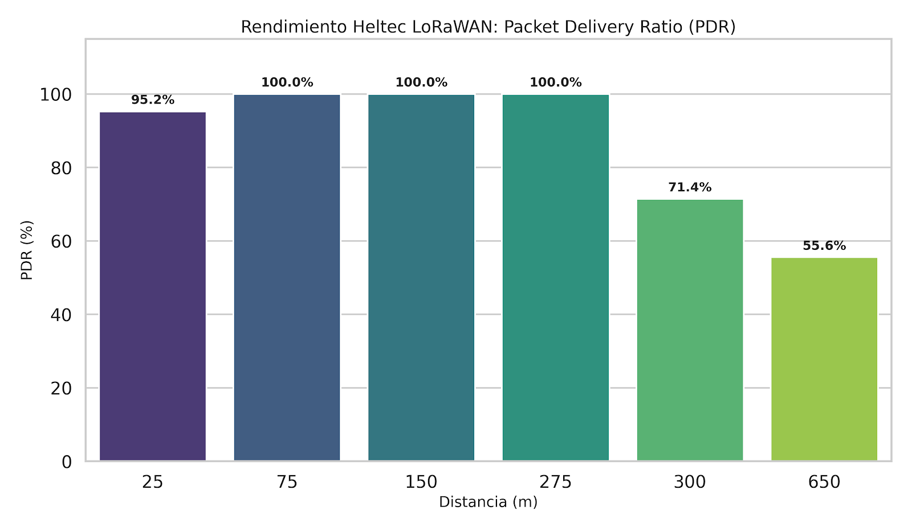
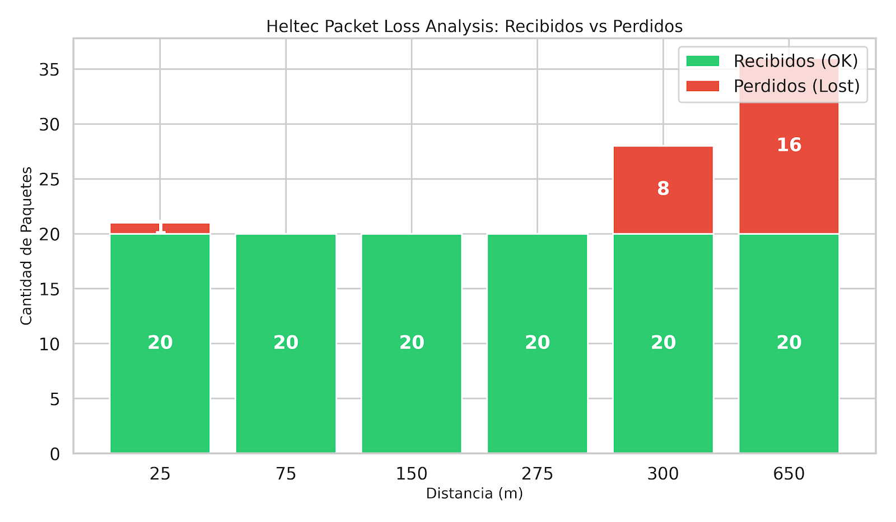
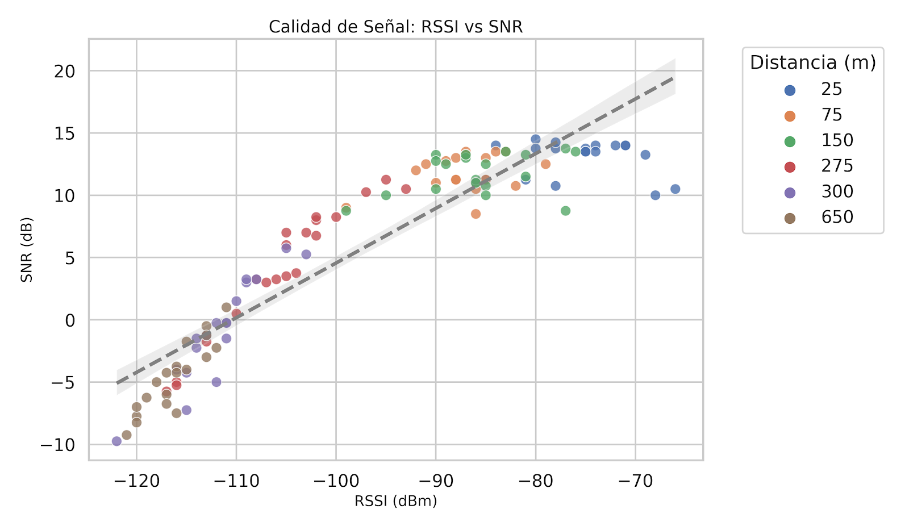
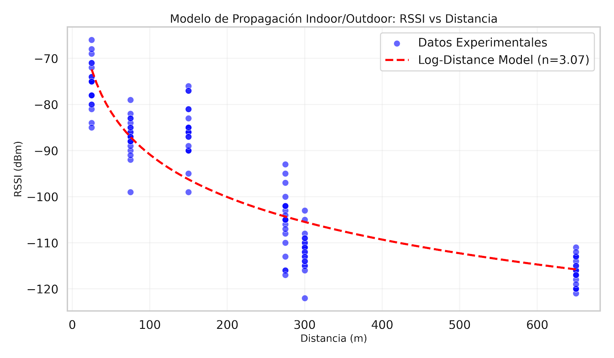

# 📊 Pruebas de Rendimiento: Cobertura Base LoRaWAN (SF7)

Este documento detalla los resultados de las primeras pruebas de campo realizadas por la comunidad **TECHHUB Cuenca**. El objetivo de este estudio es establecer una **línea base de rendimiento** para el hardware estándar utilizado en la comunidad (Heltec), bajo una configuración de velocidad máxima y menor consumo (Spreading Factor 7).

---

## 🛠️ Configuración de la Prueba

Para garantizar la reproducibilidad de los resultados por parte de otros miembros de la comunidad, se detallan las condiciones técnicas del experimento:

### Hardware Utilizado
| Componente | Modelo | Configuración |
|:---|:---|:---|
| **Nodo Final** | Heltec WiFi LoRa 32 (V3) | Antena Stock (Heltec) |
| **Gateway** | Heltec HT-M7603 | Indoor / Packet Forwarder |

### Parámetros de Red (US915)
Se fijaron los parámetros para evaluar el comportamiento del enlace en su configuración más "débil" (menor sensibilidad, mayor velocidad):
* **Spreading Factor (SF):** 7 (Fijo)
* **Ancho de Banda (BW):** 125 kHz
* **Coding Rate (CR):** 4/5
* **Potencia de Transmisión:** TX Max (según banda)

---

## 📈 Análisis de Resultados

A continuación se presentan los datos recolectados en campo, procesados para evaluar la confiabilidad, calidad de señal y comportamiento de propagación.

### 1. Confiabilidad del Enlace (Packet Delivery Ratio)

El **PDR (Packet Delivery Ratio)** mide el porcentaje de paquetes que llegaron exitosamente al gateway. Esta métrica es crítica para determinar el "radio de confianza" para aplicaciones IoT.

**Observaciones:**
* **Zona Segura (0 - 275m):** Se obtuvo una efectividad del **100%**. Esto confirma que, incluso con SF7 y un gateway en interior, la conexión es perfecta en distancias cortas-medias.
* **Zona de Transición (300m):** La confiabilidad cae al **71.4%**. Aquí comienzan a notarse los efectos de la atenuación por obstáculos urbanos.
* **Límite Operativo (650m):** Con un PDR del **55.5%**, el enlace es inestable para aplicaciones críticas, sugiriendo la necesidad de aumentar el Spreading Factor (SF9/SF10) para esta distancia.

---

### 2. Integridad de Datos: Paquetes Perdidos

Más allá de los porcentajes, es vital visualizar la pérdida física de información. El siguiente gráfico compara los paquetes esperados (según el contador de tramas `fCnt`) vs. los realmente recibidos.

> **Nota Técnica:** La aparición de barras rojas a partir de los 300 metros indica que el nivel de señal (RSSI) cayó por debajo de la sensibilidad del receptor para la velocidad de datos configurada.

---

### 3. Calidad de Señal: Correlación RSSI vs SNR

Analizamos la relación entre la **Potencia de la Señal Recibida (RSSI)** y la **Relación Señal/Ruido (SNR)**.

**Hallazgos:**
* Existe una **correlación fuerte** entre la distancia y la degradación de calidad, lo que indica un entorno de propagación predecible.
* A **650 metros**, el sistema operó con un SNR negativo promedio de **-4.62 dB**. Esto demuestra la robustez de la modulación LoRa, capaz de demodular señales por debajo del piso de ruido incluso en SF7.

---

### 4. Modelo de Propagación (Path Loss)

Para caracterizar el entorno urbano de Cuenca, ajustamos los datos experimentales a un modelo logarítmico de pérdida de trayectoria (*Log-Distance Path Loss Model*).

**Caracterización del Entorno:**
El exponente de pérdida de trayectoria obtenido es **$n \approx 3.66$**.

* $n = 2.0$: Espacio libre (sin obstáculos).
* **$n = 3.66$**: Este valor corresponde a un **entorno urbano denso** o con obstrucciones significativas (edificios, paredes, vegetación). Valida que la ubicación *indoor* del gateway y la topografía de la ciudad impactan considerablemente la señal.

---

## 🏁 Conclusiones y Recomendaciones

Basado en esta primera caracterización para **TECHHUB Cuenca**:

1.  **Alcance Efectivo SF7:** Para despliegues que requieran bajo consumo y alta velocidad, el radio seguro con gateway indoor es de aproximadamente **275 metros**.
2.  **Estrategia de Despliegue:** Para nodos ubicados a más de 300 metros, es mandatorio habilitar **ADR (Adaptive Data Rate)** o configurar manualmente un SF mayor (SF9 - SF10) para garantizar la entrega de paquetes.
3.  **Validación de Hardware:** Los equipos Heltec mostraron un rendimiento consistente, capaz de recuperar información con niveles de señal de hasta **-120 dBm**.

---
